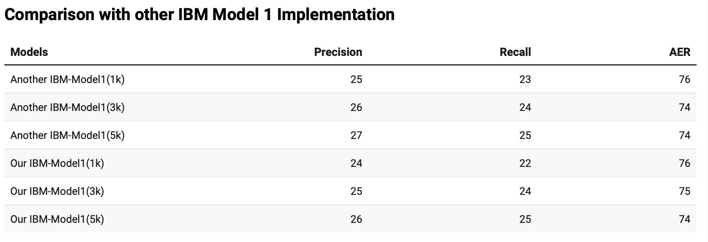
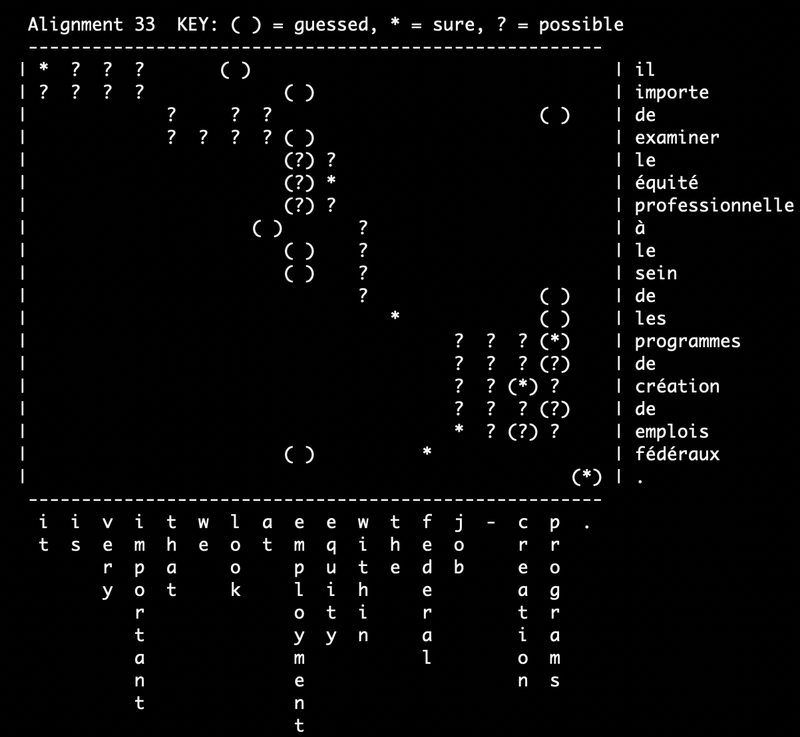
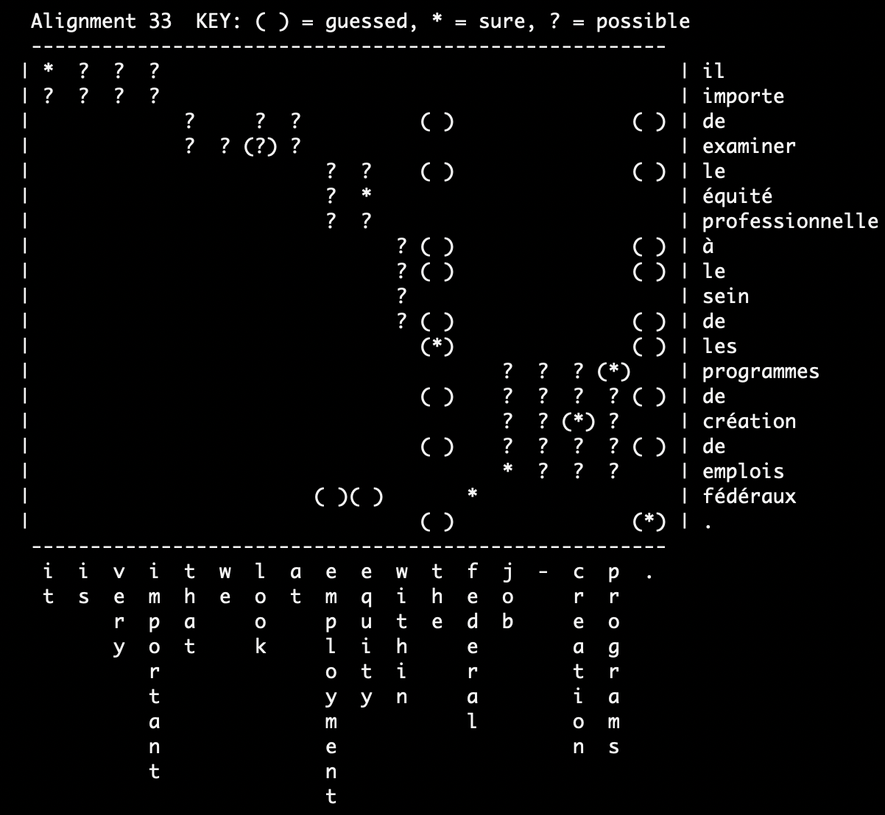

# CL20 Assignment 4: Word-to-word Aligner

The implementations of the IBM model 1 aligner trained with EM algorithm. We build a IBM model 1 to align the French-English setence pairs. We compare our implementation model with other IBM model 1 and higher version IBM model `fast_align` on the hansards parallel sentences.

* New January 15th, 2021, IBM model 1 aligner.
* New March 10th 2021, Speed up our aligner with numpy. 

## Reports

The report is in `/reports/reports.pdf`.

## Setup and Data

1. python version and dependencies 

We uses python 3.7. Before execute file, please install the dependencies:
`pip install -r requirements.txt`

2. prepare data and evaluation script

The implementation uses the sentence files under the `hw2/data/` folder. 
Make sure these files (`hansards.f`, `hansards.a`, `hansards.e`) are included.

We use `score-alignments` for calculating precision, recall and alignment error rate.

### Data Format

For `hansards.f`, `hansards.e`, `hansards.a`, the file extensions `.f`, `.e` and `.a` refer to french, english, alignment files respectively.
The sentences files `hansards.f`, `hansards.e` contains the sentences per line. Words and punctuation are separated by whitespace. 

Alignment file is the word-to-word alignment. The notation i-j means the source language word at position iis aligned to the targert word at position j. Target words aligned to special token `NULL` in source language sentence are ignored.

### Output Files 

We test the baseline model, our implementation, compare it with another implemenation and IBM model 2 `fast_align` to discuss their performances.
All the alignment files are collected in `results`.

* `results/IBM.alignment`: Word-to-word alignment result obtained from our IBM model 1.
* `results/dice.a`: Result of baseline model obtained by the `align` in the [JHU MT Class](http://mt-class.org/jhu/hw1.html).
* `results/dice-#k.a`: Evaluating result of another IBM model 1 implementation. 
* `results/reverse-#k.align`: Result from `fast_align` implementation.

## Run the aligner

Running 100k hansards parallel sentences for one iteration requires **3** minutes.

### Basic Usage

Our aligner provides simialr user-interative-command as the baseline aligner. \
To run our code, you can do: 

```
python run_aligner.py -number 100000 -iteration 1 -output results/IBM1.alignmen \
```

The option `--number` decides number of examples will be used for EM algorithm. \
`--iteration` specifies number of training iterations. The word-to-word alignment \
will be saved automatically.

For running the aligner on the other data, you need specify options `--data_dir` for sentence file folder
, `--english` for the target sentence file and `--french` for the source sentence file.

The output file of the aligner is word-to-word alignment for the parallel sentences.

`IBM.alignment` stores the French-English aligments for the sentence pair:
```
0-9 1-21 2-9 3-9 4-9 5-9 6-9 7-9 8-14 9-8 10-9
0-1 1-1 2-1 3-1 4-1 5-1 6-1 7-1 8-1 9-1 10-4 
...
...
```

### Evaluate the result

To evaluate the result, you should use `score-alignments`. We uses the scripts for all the experiements we have tried.

```
python score-alignments < IBM.alignment
```

### Compare with other Implemenation 

We compare our implementation with other on 1000, 3000 and 500k sentence pairs. It gives similar results between the two implementations.




### Compare with `fast_align`

We evaluates our IBM model 1 with the second version of model `fast_align` on different scale datasets. We set the iteration 1 and train them on 10000, 30000, 50000, 80000 sentence pairs. 

Both models perform better when increasing training examples. The `fast_align` can achieve the 28 accuracy with only 1000 examples but our IBM model requires 8x examples. In the recall score, the `fast_align` on 1k, 3k, 5k and 8k are not as good as its precision.   


### Visualizations 

We visualize the a aligments example from our implemenation and the baseline. 

Alignments (our)             |  Alignment (other)
:-------------------------:|:-------------------------:
  |  
