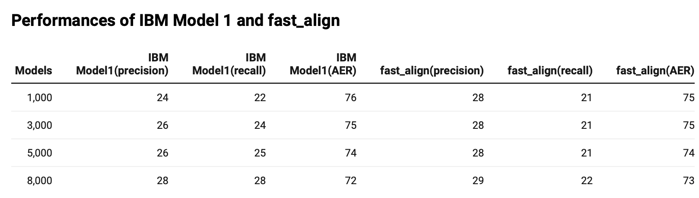

# CL20: Assignment 4

Implementation og the IBM model aligner. We build a IBM model 1 to align English-French setence pair. We compare the implementation model with other model 1 implementation and `fast_align` on the hardsards parallel sentences.

## Setup and Data

1. python version and dependencies 

We uses python 3.7. Before execute file, please install the dependencies:
`pip install -r requirements.txt`

2. prepare data

The implementation utilise sentence files under the `hw2/data/` folder. 
Make sure those files (`hansards.f`, `hansards.a`, `hansards.e`) are included.

### Results Files 

We test the original baseline model and compare our IBM model 1 with another implemenation and IBM model 2 `fast_align` to check their performances.
All the file are collected in `results`.

* `results/dice.a`: Evaluating result of baseline model.
* `results/myIBM-#k`: Evaluating result of our IBM model 1.
* `results/dice-#k.a`: Evaluating result of another IBM model 1 implementation. 
* `results/reverse-#k.align`: Evaluating result of `fast_align` .

## Run the aligner

### Basic Usage

Our aligner provides simialr arguments for user 

```
python run_aligner.py -n 10000 > myIBM-1k
```

The file `myIBM-1k` will have 1000 aligments examples:
```
0-9 1-21 2-9 3-9 4-9 5-9 6-9 7-9 8-14 9-8 10-9
0-1 1-1 2-1 3-1 4-1 5-1 6-1 7-1 8-1 9-1 10-4 
...
...
```

### Evaluate the result

For evaluate the result, you should use `score-alignments`. We uses the scripts for all the experiements we have tried.
```
python score-alignments < myIBM-1k
```

### Compare with other Implemenation 

We compare our implementation with other on 1000, 3000 and 500k sentence pairs. It gives similar results between the two implementations.


### Compare with `fast_align`

We evaluates our IBM model 1 with the second version of model `fast_align` on different scale datasets. We set the iteration 1 and train them on 10000, 30000, 50000, 80000 sentence pairs. 

Both models perform better when increasing training examples. The `fast_align` can achieve the 28 accuracy with only 1000 examples but our IBM model requires 8x examples. In the recall score, the `fast_align` on 1k, 3k, 5k and 8k are not as good as its precision.   




