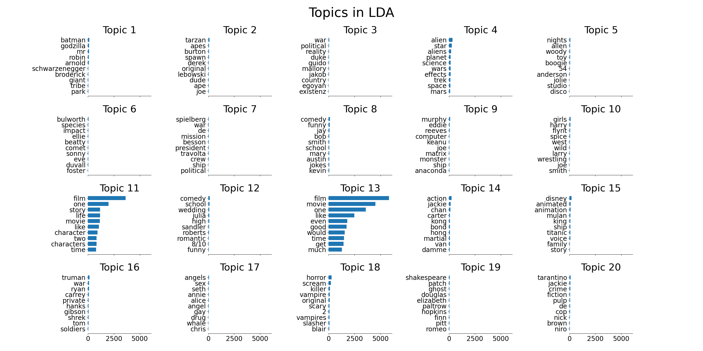
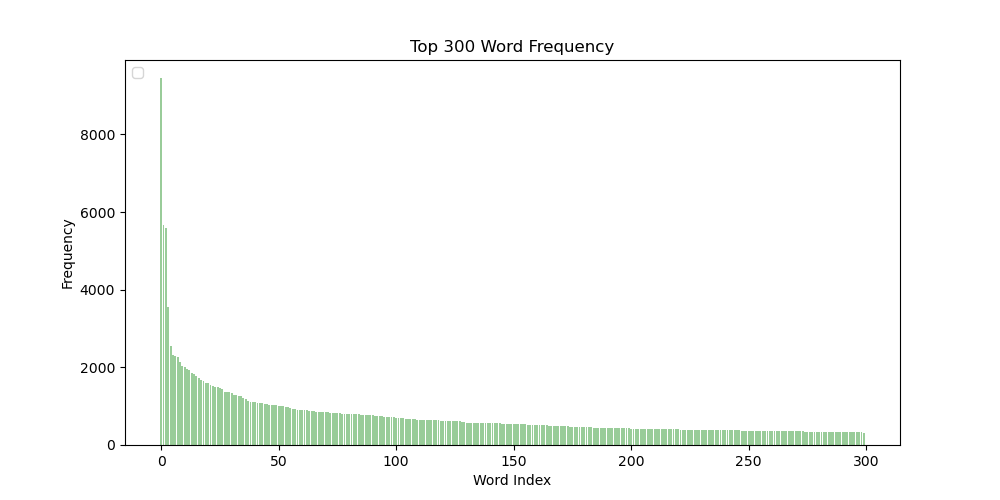
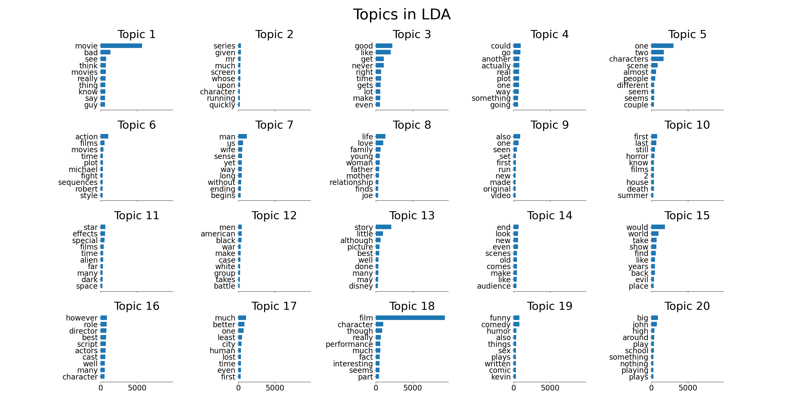

# CL20: Assignment 5

Topic modeling: Latent Dirichlet Allocation using Gibbs sampling. The Implementation of LDA model automatically discovers topics that documents contain. The model was trained on 2000 movie views with 20 topics and 500 iterations.

## File structure 

```
|--data
|  |-- movices-pp.txt
|  └-- vocab.txt
|
|-- images
|   └-- img-v1.pn
|
|-- report
|   └── report.pdf
|
|-- results
|   └── 2021-01-25_01-00-15
|       |-- main.log
|       |-- param.json
|       |-- out.word
|       |-- zw-iteration100.npz
|       └-- mw-iteration100.npz
|
|-- build_vocab.py
|-- LDA.py
|-- plot_frequency.py
|-- run_analysis.py
|-- run_topk.py
└── README.md
```


## Reports

the report is in `/reports/reports.pdf`.

## Setup and Data preparation

1. python version and dependencies 

We uses python 3.7. Before execute file, please install the dependencies:
`pip install -r requirements.txt`

2. prepare data and evaluation script

The implementation utilise movie reviews under the `data` folder. Make sure this file (`movies-pp.txt`) are included.

The movie review file `data/movies-pp.txt` contains one document per line, each word was separated by whitespace.

3. build vocabulary file for running `LDA.py`

Run the maind to build vocabulary for movie reviews.

```
python build_vocab.txt
```

### Result Files 

The main script `LDA.py` creates a folder to store log, most k frequent words file, model's hyperparameters and 
learned matrix under the `/results/`. All the files were collected in `results/#RESULT/`.

The result folder `#RESULT` was named as one in datetime format `year-month-data_hour-minute-second`. For instance, the result
folder `2021-01-25_01-00-15` stores every files generated by `LDA.py` program. 

* `results/2021-01-25_01-00-15/main.log`: Log file for running LDA file `LDA.py`.
* `results/2021-01-25_01-00-15/params.json`: Parameters for LDA class.
* `results/2021-01-25_01-00-15/out.word`: K most frequent words for each topic with normalized frequency in 2D top-word array per line.  
* `results/2021-01-25_01-00-15/mz-iteration#NUMBER.npz`: Numpy npz file 2D-array, numbe of times document `m` and topic `z` co-occur.
* `results/2021-01-25_01-00-15/zw-iteration#NUMBER.npz`: Numpy npz file, 2D-array, number of times topic `z` and word `w` co-occur.

## Runtime

We speed up the calculation by using numpy to create the counting matrices and vectors. 

To sample a topic `z` from multinomial distribution, we count the `document-topic` and `topic-word` co-occurences in the 2D arrays with shapes (`number of documents`, `number of topics`) and (`number of topics`, `vocabulary size`). The co-occurence matrices were normalized by the total number of topics for each document and number of words for each topics vectors separately. In gibbis sampling, the probability of topic `z` for specific word `w` at position `i` in a document is proportional to the multiplication of the two normalized matrices. 

We ran the `LDA.yp` on 2000 movie reviews with the hyperparameters `alpha=0.02`, `beta=0.1`, 500 iterations and 20 topics in **2 hours 47 minutes**. We save the unnormalized topic-word matrix as `npz` files every `100` iterations (`save_per_iteration=100`). The runningtime records can be found in lgo file `results/2021-01-25_01-00-15/main.log`. 

We also ran the program with same hyperparameters but using `alpha=50` in **2 hours 55 minutes**. The log file exists in the path `results/2021-01-25_11-14-11/main.log`. 

## Run the LDA with Gibbs sampling

### Basic Usage

Before running the main script `LDA.py`, make sure that `data/vocab.txt` exists in the path.

In the `main` function, we set hyperparameters with `alpha=0.02`, `beta=0.1`, `n_iteration=500`, `n_topic=20`, `top_k=10` and `save_per_iteration=100` as default for training LDA on movie reviews. The program trains LDA model with `n_topic` latent topic variables and will save `document-topic` as `topic-word` co-occurence matrices every 100 iterations. Most `top_k` frequent words will be saved in a text file `out.word` with the 
correspond value in `topic-word` matrix per line. 

You can run it in the default setting. All the relevant files will be stored in the result folder.

```
python LDA.py 
```

### Visualize Top k word

After running the main script, k most frequent words for each topic and the corresponding values will be exported as text file `out.word` in result folder. 

To visualize the most `top_k` frequent words for each topic, we plot `n_topic` bar charts ranked by its frequency. The figure will be saved in `images` folder with the name of `result folder`. You can run the command.

```
python run_topk.py
```

## Results

We run the LDA model in two hyperparameter settings and analysis the learned `topic-word` matrix in the optimal one. We found that the LDA model trained with default hyperparameter assigns movie relevant words to latent topics and can easily observe meaningful topic, such as words related to `horroric film` or particular film `star trek`. While implementing the LDA model, we curious the sampling frequency for `top-word` matrix. Therefore, we export the corresponding frequency for each word in the top and uses the matrix as distributed representation for computing word similarity. 

For the second LDA model, only modifying `alpha=50`, the most frequent words in the topic seems don't have specific meaning. The outline of results and discussions as fellows: 

* Optimial LDA
* Alpla-25 LDA model
* Analysis word distribution over topics

Note: the bold text is the words selected in the latent topics.


### Optimal LDA  


*Figure 1. The first figure shows the top 10 words in the 20 topics generated by LDA with `alpha=0.02` and `beta=0.1` over 2000 movie review in 500 iterations.*

We observe 11 topics in the result trained on default setting: 

* **Movie characters (topic 1)** 
* **Planet of the Apes (topic 2)** 
* **Space science (topic 4)**  
* **Boogie nights (topic 5)**  
* **Frequent words (topic 11, 13)**  
* **The wedding singer (topic 12)**  
* **Martials arts (topic 14)**  
* **Disney animation (topic 15)**  
* **Horroric film (topic 18)**:    
* **Shakespeare (topic 19)**: 
* **Crime films directed by Tarantino (topic 20)**: pulp fiction, jackie nrown  
* **Pulp fiction (topic 20)**: Quentin Tarantino. 

**Movie characters (topic 1)** are mostly charactor, like **batman**, **godzilla**, **arnold schwarzenegger**. This is the only one we found related to character in the movies. Most topics are related to particular movie or genre. For intance, the frequent words in **Space science (topic 4)** are related to **star trek**, such as **alien**, **aliens**, **planet**, **wars**, **space**, **mars**, **planets**.

Similar topics like **Boogie nights (topic 5)**, **The wedding singer (topic 12)**, **Martials art (topic 14)**, **Disney animation (topic 15)** and **Pulp fiction (topic 20)** are the topics for specific movie or animation:  **Boogie nights (topic 5)** is period drama film directed by Paul Thomas **Anderson** and the story is in the late 1970s **disco** era. **The wedding singer (topic 12)** is **romantic comedy** film produced by **Robert Somonds**. In the film, a wedding singer (Adam **Sandler**) meets and befriends **Julia** and later fall in love with each other.

In addition, **Martial arts (topic 12)** is about the **hong kong martial** artist **Jackie Chan** and his **action** movie. **Disney animation (topic 15)** is a topic for **disney animation**, such as the **animated** movie **Titanic** and **Mulan**. **Crime films directed by Tarantino (topic 20)** is another topic for the crime films directed by Quantin **Tarantino**, such as **pulp fictions** and **Jackie Brown**.

The other move-revelant topics like **Planet of the Apes (topic 2)** and **Shakespeare (topic 19)** have frequent words related to the film or to Shakespeare's works.

There is a **Horroric film (topic 18)** topic for horroric words, such as **horror**, **scream**, **killer**, **vampire**, **scary**, **vampires** and **slasher**.

**Frequent words (topic 11, 13)** are a special case in our result. The frequent words in theses topics have higher frequencise than the words in the other topics. Most frequent words in other topics (`2021-01-25_01-00-15/out.word`) have the ammount under one thousand on averag. But words in topic 11 and 13  were highly sampled.

The two topics learn collecting most frequent words in the movie reviews. We count the word frequency by running the script `plot_frequency.py`. It writes vocabulary file with frequency `data/frequent-wrod.txt` and plot the top 300 frequent words bar chart saved in data folder `data/wordFrequency-3000.png`.


*We plot top 300 frequent words in movie reviews out of 46517 words. A few words have the dominant frequency than other words.*

The most frequent words in topic 11 and 13 are mostly from the high frequent words in the movie reviews. We list most 20 frequent words in the file bellow. The most frequent 6 words in the topic 13 are the most 6 frequent words in the movies reviews. Topic 11 does not have same frequency order as topic 13. But they covers 14 frequent words out of most 20 frequent words in the reviews.

```text
1. `**`film`**` 9443
2. **movie** 5671
3. **one** 5580
4. **like** 3545
5. **even** 2556
6. **good** 2316
7. **time** 2282
8. **would** 2264
9. **story** 2145
10. **much** 2024
11. **character** 1996
12. also 1965
13. **get** 1925
14. **characters** 1858
15. **two** 1827
16. first 1769
17. see 1731
18. way 1669
19. well 1655
20. could 1609
```

The sampling frequency in the default setting has huge unbalanced phenomena between topic 11, 13 and the other. We are curious about using other hypermeter to observe the smapling frequency and latent topic modeling. Thus, we tried to trained the LDA model by modifying `alpha` as bellow. 

### Alpla-25 LDA model


*Figure 2. The second figure shows the model ran in the same setting but using `alpha=25`. All the other hyperparameters are same as previous one.*

The high frequent words in the movie reviews, such as `film`, `movie`, `good`, `like` and `one`, occur in this result. But they are not in a topic group. We can not even find any group that has inner similarity between their frequent words as in previous result.

Although the sampling frequency are more balanced in term of comparing with tpoics which has relative higher frequencies  , like topic 11, 13 in previous result. It wasn't assigned simialr words to one particular topic. We still curious if there is relation between sampling frequency or topic modeling. We are planing to observe more sucecessful exmaples to see if similar phenomena when word frequencies are high unbalanced.


### Analyse the word distribution over 20 topics 

We make the assumption based on the latent variable distribution. If words has similar latent distribution, they may be similar meaning. And we can treat word as an `n` dimensional vecotr (n_topics).

We utilise the learned matrix to by computing words similarity.

