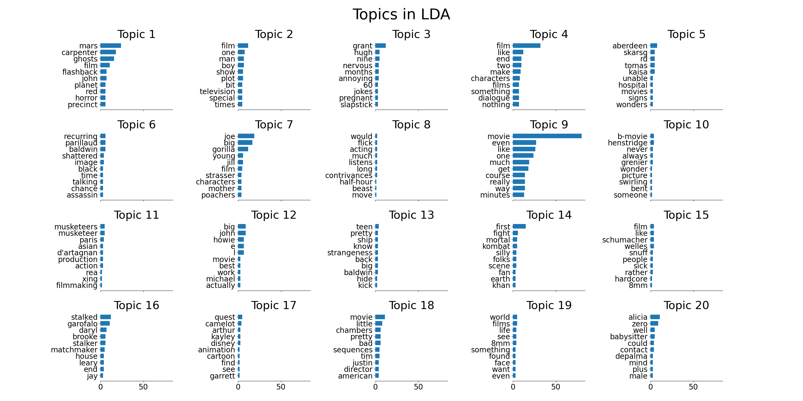

# CL20: Assignment 5

Topic modeling: Latent Dirichlet Allocation using Gibbs sampling. The Implementation of LDA model 
automatically discovers topics that documents contain. The model was trained on 2000 movie views with 20 topics and 500 iterations.


## To-Do
1. LDA and Gibbs sampling
2. Most frequent word
3. Report 

## File structure 

```
|--data
|  |-- movices-pp.txt
|  └-- vocab.txt
|
|-- images
|   └-- img-v1.pn
|
|-- results
|   └── 2021-01-24_21-34-39
|       |-- main.log
|       |-- param.json
|       |-- out.word
|       |-- zw-iteration100.npz
|       └-- mw-iteration100.npz
|
|-- build_vocab.py
|-- LDA.py
|-- run_analysis.py
|-- run_visual.py
└── README.md
```


## Reports

the report is in `/reports/reports.pdf`.

## Setup and Data preparation

1. python version and dependencies 

We uses python 3.7. Before execute file, please install the dependencies:
`pip install -r requirements.txt`

2. prepare data and evaluation script

The implementation utilise sentence files under the `data` folder. 
Make sure those files (`hansards.f`) are included.

The movie review file `data/movies-pp.txt` that contain one document per line, each words separated by space.

```
python build_vocab.txt
```


### Result Files 

We test the baseline model, our implementation, compare it with another implemenation and IBM model 2 `fast_align` to discuss their performances.
All the file are collected in `results`.

* `results/dice.a`: Evaluating result of baseline model.
* `results/myIBM-#k`: Evaluating result of our IBM model 1.
* `results/dice-#k.a`: Evaluating result of another IBM model 1 implementation. 
* `results/reverse-#k.align`: Evaluating result of `fast_align` .

## Run the LDA with Gibbs sampling

### Basic Usage

Our aligner provides simialr user-interative-command as the baseline aligner
To run our code, you can do: 

```
python LDA.py 
```

### Visualize Top k word


```
python visual.py
```

## Runtime

## Results

To evaluate the result, you should use `score-alignments`. We uses the scripts for all the experiements we have tried.

```
python score-alignments < myIBM-1k
```

The figure shows the top 10 words in the 20 topics generated by LDA over 2000 movie review.




## Analyse the word distribution over 20 topics 


